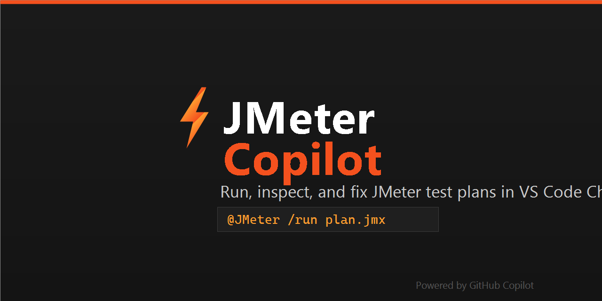
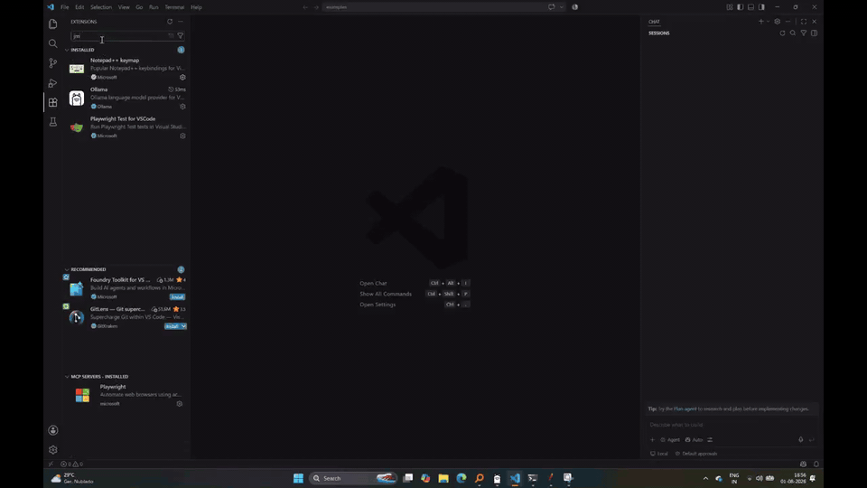

<p align="center">
  
</p>

<h1 align="center">⚡ JMeter Copilot</h1>

A **Copilot-powered Apache JMeter assistant** for Visual Studio Code. Run JMeter test plans, inspect live and past results, review request/response details, and let Copilot **fix and verify your JMX scripts** — all from the Chat view, the sidebar, or the command palette.

  

---

## 🎬 Demo

<p align="center">
  
</p>

*See JMeter Copilot in action: run a plan, stream live results, and fix failures with Copilot.*

> 📺 **Full demo video:** [demo_720p.mp4 (GitHub)](https://github.com/anshuparik/jmeter-copilot/releases/download/demo-assets/demo_720p.mp4)

## ✨ What it does

- **Run JMeter test plans** — from the sidebar (Test Plans view), the explorer context menu, the command palette, or Copilot Chat (`@JMeter /run`).
- **Auto-detect JMeter** — finds `jmeter`/`jmeter.bat` via settings, `JMETER_HOME`, `PATH`, and common install locations.
- **Live results** — a Results panel streams sample counts into the editor while JMeter runs.
- **Detailed inspection** — for each sample: URL, method, status, elapsed/latency, request & response headers, request body, response body, and assertion results.
- **Recent Runs history** — every execution is recorded with the plan name, timestamp, and pass/fail summary; click any entry to reopen its results.
- **Copilot tools** — `list_jmeter_tests`, `run_jmeter_test`, `get_jmeter_failures`, `get_jmeter_sample_detail` are registered so Copilot can act on your behalf.
- **Stop & Clear** — interrupt a running test, or clear the results and history.

---

## 📦 Installation

### Option A — Install from the VS Code Marketplace (recommended)

1. Open the **Extensions** view (`Ctrl+Shift+X`).
2. Search for **"JMeter Copilot"**.
3. Click **Install**, then **reload** the window (`Ctrl+Shift+P` → `Developer: Reload Window`).

Or install from the command line:

```bash
code --install-extension anshupareek.jmeter-vscode-copilot
```

### Option B — Install from a VSIX file

1. Download `jmeter-vscode-copilot-<version>.vsix`.
2. In the Extensions view, click **⋮ → Install from VSIX…**.
3. Select the `.vsix` file, then reload the window.

### Option C — Build from source

```bash
git clone https://github.com/anshuparik/jmeter-copilot.git
cd jmeter-copilot
npm install
npm run vsix            # produces jmeter-vscode-copilot-<version>.vsix
code --install-extension jmeter-vscode-copilot-<version>.vsix
```

After installing, **reload the window** (`Ctrl+Shift+P` → `Developer: Reload Window`).

---

## 🚀 Getting Started

1. Make sure JMeter is installed (or configure it in settings).
2. Open a workspace that contains your `.jmx` test plans (or open a `.jmx` file).
3. In the **Activity Bar**, click the **⚡ JMeter** icon (sidebar).
4. Under **Test Plans**, click the ▶ play icon next to a plan — or right-click a `.jmx` file in the Explorer and choose **JMeter: Run Test**.
5. The **Results** panel opens in a side editor and streams results live.

> If JMeter isn't found automatically, set `jmeter.jmeterHome` or `jmeter.executablePath` in Settings (see below), then reload.

---

## 💬 Using Copilot Chat

Open **Copilot Chat** and use the `@JMeter` participant:

```
@JMeter /run PerformanceTestPlanMemoryThread.jmx
```

| Command | Description |
| --- | --- |
| `/run [plan.jmx]` | Run a JMeter test plan (optionally by name) |
| `/failures` | Show detailed list of failing samples from the latest run |
| `/fix` | Analyze the latest run's failures and suggest a fix plan |

### Copilot tools

Registered via `vscode.lm.registerTool`, so Copilot can call them automatically:

| Tool | Input | Returns |
| --- | --- | --- |
| `list_jmeter_tests` | — | All `.jmx` files discovered in the workspace |
| `run_jmeter_test` | `planPath` | Run summary (total / passed / failed) + run id |
| `get_jmeter_failures` | `runId?` | Detailed failures (assertions, URLs, response snippets) |
| `get_jmeter_sample_detail` | `label`, `runId?` | Full JSON detail for a sample |

---

## ⚙️ Settings

| Setting | Default | Description |
| --- | --- | --- |
| `jmeter.executablePath` | `""` | Absolute path to the JMeter executable |
| `jmeter.jmeterHome` | `""` | JMeter home directory (auto-detected if empty) |
| `jmeter.javaPath` | `""` | Java executable path |
| `jmeter.maxResponseBytes` | `100000` | Maximum response bytes kept per sample |
| `jmeter.captureResponseData` | `true` | Capture response/request headers, bodies & assertions |
| `jmeter.resultsDirectory` | `""` | Directory for run artifacts (defaults to `<workspace>/.jmeter-runs`) |
| `jmeter.extraProperties` | `{}` | Extra JMeter properties passed to the run |

> When empty, JMeter is located via (in order): `jmeter.executablePath` → `jmeter.jmeterHome` → `JMETER_HOME` env var → `PATH` → common install directories.

---

## 📚 Examples

### Run a plan from the sidebar

```
Test Plans
└── PerformanceTestPlanMemoryThread.jmx   ▶  (click play)
```

Results panel shows:

```
⚡ Running... 4 samples (1 failed)
```

then after completion:

```
✅ 3/4 passed · 1 failed
```

### Inspect failures and fix

```
@JMeter /failures
```

```
### 🔍 JMeter Failure Details

Sample: /kitchen-sink/http-methods/put
Status: 200 OK
Assertions:
  - Assertion (Response Assertion code): Test failed: code expected to contain /211/
```

Then edit the JMX assertion (`211` → `200`), re-run, and the failures tool reports *"No failing samples found."* — the fix is verified.

---

## 🔗 Links

- **Source & issues:** [github.com/anshuparik/jmeter-copilot](https://github.com/anshuparik/jmeter-copilot)
- **License:** MIT — see [LICENSE](LICENSE)

---

Built with ❤️ for Apache JMeter users who want performance testing inside VS Code with Copilot at their side.
